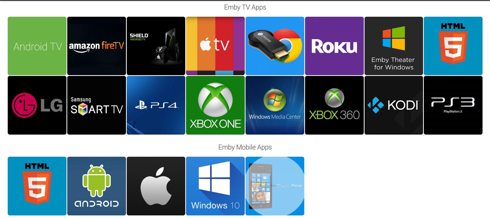
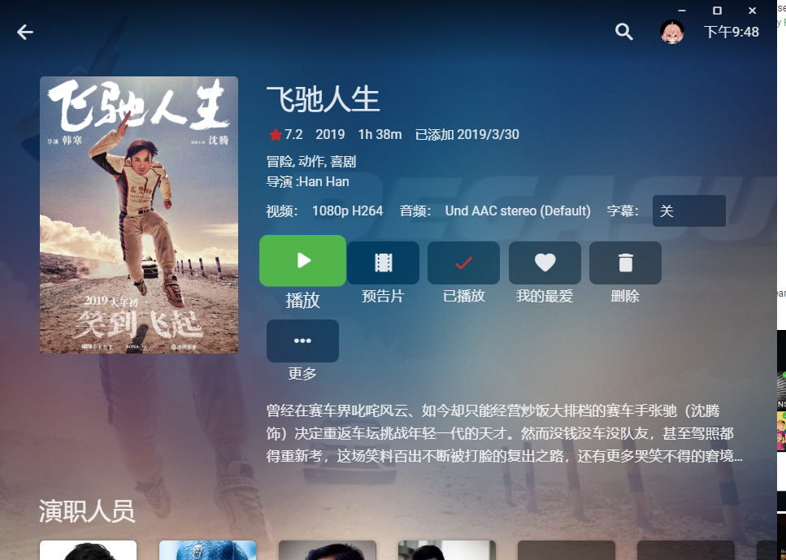
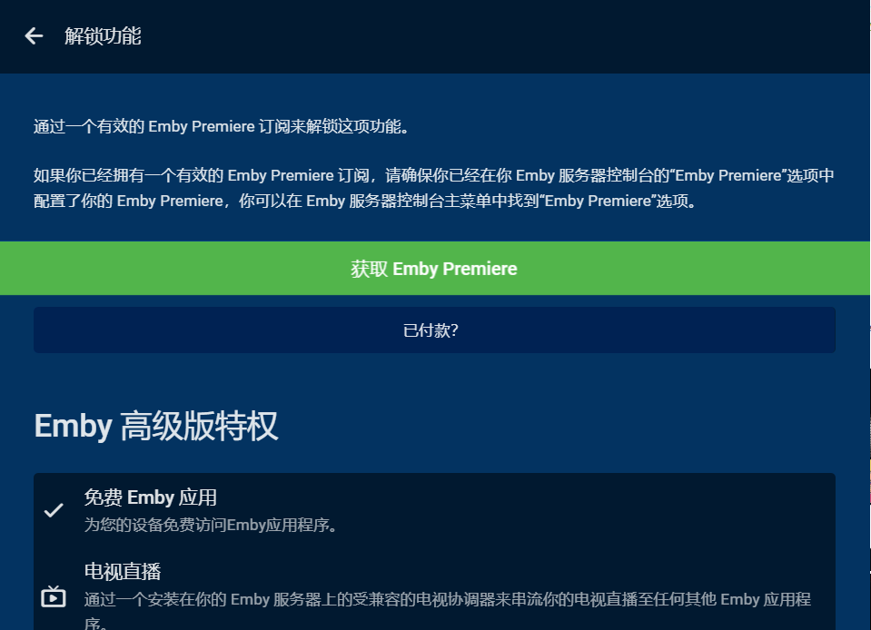
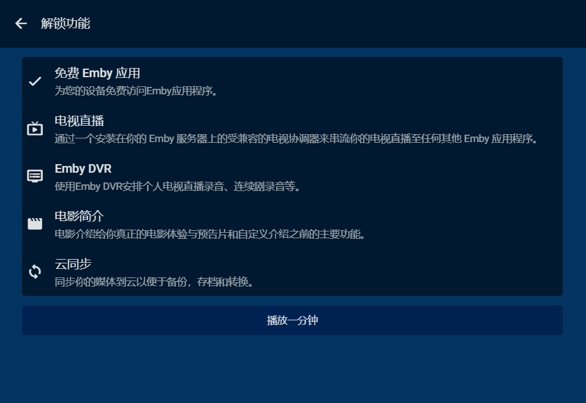
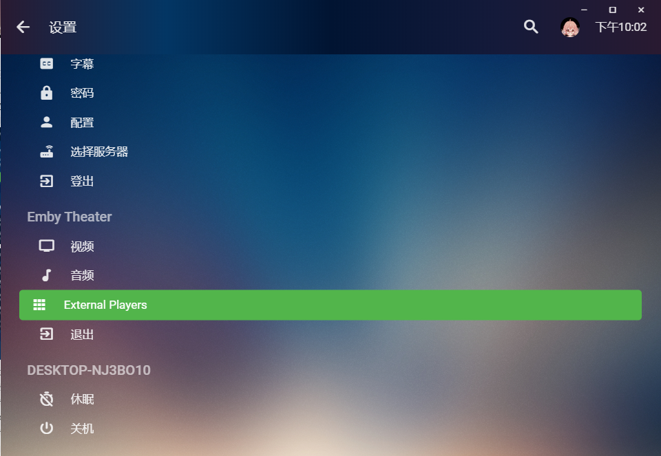
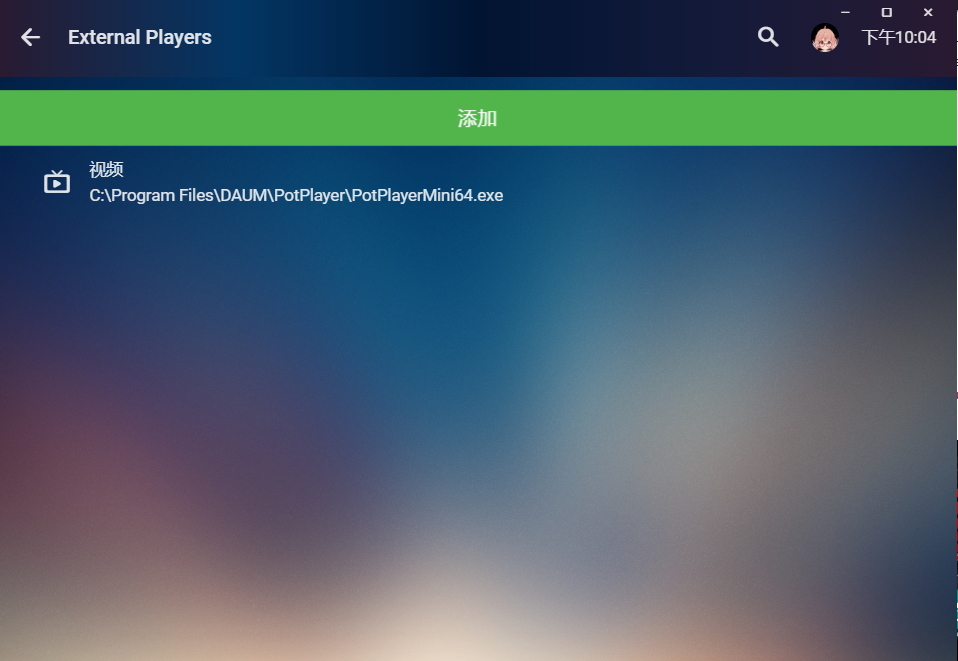

之前写了一篇如何[调用potplayer播放emby](https://blog.mrjiumi.cn/202002121619.html)的文章，虽然基本实现了功能，但是操作比较复杂，也存在一定的局限（不能播放H265编码视频）。  
经过不懈努力，终于找到了另一种调用的方式，下面介绍给大家。
<!-- more -->

## Emby Theater for Windows  
emby有一个很大的优势就是全平台，这个全平台不仅仅是服务端，客户端也是。  

这次调用的关键就在于Emby Theater for Windows([点击下载](https://embydata.com/downloads/theater/release13/setup.exe))。  
Emby Theater for Windows是emby官方的windows客户端，界面和网页版类似,操作逻辑也与网页版一致，无任何上手难度。 


但是，Emby Theater for Windows有一个致命的缺点，导致它的覆盖率一直不广，那就是这个软件必须订阅emby premiere才能播放视频，没有会员订阅的用户只能**试播一分钟**。


正是这**试播一分钟**给我们留下了机会，亲测试播一分钟只针对官方播放器限制，选用第三方播放器（potplayer等）完全不受一分钟时间的限制，可谓是一举两得，既破解了没有premiere订阅的时常限制，又拜托了鸡肋的官方播放器，调用功能强大的第三方播放器播放。

## 调用第三方播放器设置
在Emby Theater for Windows里调用第三方播放器的方法也十分简单，`设置-External Player`就可以直达添加第三方播放器的页面。


在添加的页面中，添加第三方播放器的路径和命令行参数就可以了。
```yml
播放器路径: C:\Program Files\DAUM\PotPlayer\PotPlayerMini64.exe  #Potplayer默认安装位置
命令行参数：{path}
```
